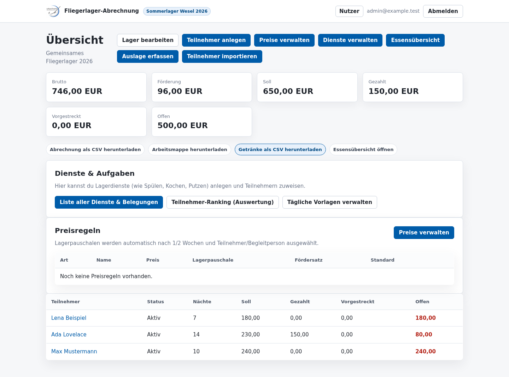
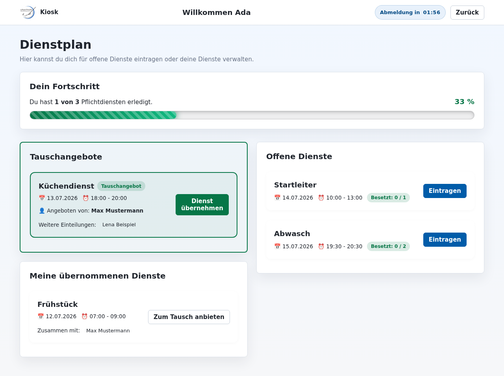

# Fliegerlager-Abrechnung

[](https://github.com/LSF-Wesel-Rheinhausen/LSF-Fliegerlager-Webapp/actions/workflows/ci.yml)
[](#tests)
[](#tests)
[](https://www.python.org/)
[](https://www.djangoproject.com/)
[](https://github.com/LSF-Wesel-Rheinhausen/LSF-Fliegerlager-Webapp/actions/workflows/docker.yml)
[](https://github.com/LSF-Wesel-Rheinhausen/LSF-Fliegerlager-Webapp/actions/workflows/security.yml)
[](https://github.com/LSF-Wesel-Rheinhausen/LSF-Fliegerlager-Webapp/actions/workflows/pr-title.yml)


Web-App zur Verwaltung und Abrechnung eines Vereins-Fliegerlagers. Die Anwendung ist als Docker-basierte Django-App mit PostgreSQL vorbereitet und kann lokal auch mit SQLite laufen.

## Funktionen in V1

- Lager/Jahre mit Preisen und Abrechnungsregeln verwalten
- Vereinsnutzer mit E-Mail-/Passwort-Login, Nutzerverwaltung, Passwort-Reset durch Admins und Rollen `Admin` und `Bearbeiter`
- Teilnehmer, Zahlungen, Kostenpositionen und vorgestreckte Beträge pflegen
- Teilnehmer bearbeiten, ohne Datenverlust archivieren und wiederherstellen; im Kiosk ist ausschließlich das aktive Lager sichtbar
- Menschenlesbare Buchungsnummern im Format `B#00001`
- Server-seitige Abrechnung je Teilnehmer und Gesamtauswertung je Lager, inklusive individuellem Fördersatz je Preiselement sowie Hilfs- und Berufssatz
- Unveränderliche, versionierte Lager-Abrechnungsläufe mit Verlauf und historischen CSV-, Excel- und PDF-Exporten
- Übersichtliche Preisverwaltung mit Lagerpauschalen für 1/2 Wochen und Teilnehmer/Begleitpersonen, Getränke, Standardpreise für Mahlzeiten und abweichende Tagespreise
- Native Dialoge für Preisregelanlage und -bearbeitung, damit Admins im Kontext der Preisübersicht bleiben
- Teilnehmer-Kiosk: PIN-Login, PIN-Ersteinrichtung, sichtbarer Auto-Logout-Timer, große Getränketasten (Ein-Tap-Buchung) und Essensanmeldungen mit Tablet-/Mobilbedienung
- Dienstpläne: Anlage täglicher Vorlagen durch Admins, selbstständige Übernahme und Tausch von Diensten durch Teilnehmer im Kiosk sowie Tracking von Pflichtdiensten per Fortschrittsbalken
- Admin-Bearbeitung, Löschung und Wiederherstellung von Buchungen mit Änderungsprotokoll der abrechnungsrelevanten Felder
- CSV-/Excel-Import mit Vorschau und Validierung
- CSV-, Excel- und PDF-Export für Lager- und Einzelabrechnungen sowie Getränkeauswertungen

## Einblicke in das Tool

### Lagerübersicht für Admins und Bearbeiter



### Dienstplanung im Teilnehmer-Kiosk



## Lokale Entwicklung

```bash
python -m venv .venv
. .venv/bin/activate
pip install -r requirements-dev.txt
pre-commit install
npm install
python src/manage.py migrate
python src/manage.py runserver
```

Beim ersten Aufruf der Weboberfläche führt die App durch die Ersteinrichtung und legt den ersten Admin-Benutzer an.

## Docker

```bash
cp .env.example .env
# Secrets, Domain und Datenbankpasswort in .env setzen
docker compose pull
docker compose up -d
```

Danach läuft die App standardmäßig unter `http://127.0.0.1:8000`. Compose verwendet direkt das aktuelle Image
`ghcr.io/lsf-wesel-rheinhausen/lsf-fliegerlager-webapp:latest`; ein Checkout und lokaler Image-Build sind auf dem
Deployment-Host nicht erforderlich. Eine eigenständige Beispielkonfiguration liegt unter [`deploy/`](deploy/README.md).

Superuser können unter **Updates** das neueste Image samt letztem Change prüfen und nach Bestätigung installieren.
Vor dem Containerwechsel speichert der isolierte Update-Agent den laufenden Image-Digest für Rollbacks, erstellt ein
PostgreSQL-Backup und prüft anschließend den Healthcheck. Der Agent steuert den Stack über Portainer Business Edition,
erhält keinen Docker-Socket und bezieht alle Portainer-Zugangsdaten ausschließlich aus ENV/Stack-Variablen.

## Tests

```bash
.venv/bin/python -m pytest
.venv/bin/python -m pytest --cov=src/billing --cov-report=term-missing
.venv/bin/python src/manage.py check
.venv/bin/python -m ruff check .
.venv/bin/python -m ruff format --check .
.venv/bin/python -m mypy src
```

Playwright-End-to-End-Tests:

```bash
npx playwright install-deps
npx playwright install
npm run test:e2e
```

Interaktive E2E-Prüfung:

```bash
npm run test:e2e:headed
npm run test:e2e:ui
```

Lokaler Sammellauf:

```bash
npm run test:local
```

Die Python-Toolchain nutzt Ruff für Linting/Formatierung, mypy für statische Typprüfung, `factory_boy` für wiederverwendbare Testdaten und pre-commit für lokale Qualitäts- und Secret-Checks. `.env`-Dateien dürfen nicht committed werden; `.env.example` enthält nur sichere Platzhalter.

Um zusätzlich den älteren Projekt-Hook zu aktivieren:

```bash
git config core.hooksPath .githooks
```

## CI/CD & Automatisierung

Das Repository nutzt GitHub Actions für verschiedene Automatisierungen:
- **Tests (`ci.yml`)**: Führt bei jedem Push und PR die lokalen Python- und Playwright-Tests aus.
- **Docker (`docker.yml`)**: Baut und testet App- sowie Update-Agent-Image und pusht beide beim Merge in den `main`-Branch in die GitHub Container Registry (`ghcr.io`).
- **Security (`security.yml`)**: Scannt den Code und die Abhängigkeiten mit Trivy auf bekannte Schwachstellen.
- **PR Title & Changelog (`pr-title.yml`, `changelog-check.yml`)**: Erzwingen *Semantic Pull Requests* und fordern Changelog-Einträge bei Änderungen im Code.
- **Dependabot**: Hält `pip`-, `npm`- und `github-actions`-Abhängigkeiten automatisch aktuell.

## Konfiguration

Die wichtigsten Umgebungsvariablen stehen mit sicheren Platzhaltern in [`.env.example`](.env.example):

- `DJANGO_SECRET_KEY`: produktiver Secret Key, lokal nur Platzhalter verwenden.
- `DJANGO_DEBUG`: `1` für lokale Entwicklung, `0` für Docker/Deployment.
- `DJANGO_ALLOWED_HOSTS`: kommaseparierte Hostnamen.
- `CSRF_TRUSTED_ORIGINS`: kommaseparierte vertrauenswürdige Origins mit Schema.
- `DATABASE_URL`: Datenbank-URL; lokal kann SQLite genutzt werden, Docker nutzt PostgreSQL.
- `DJANGO_HTTPS`: aktiviert in Produktion HTTPS-Redirect sowie sichere Session- und CSRF-Cookies.

Pflichtvariablen für Container-Updates:

- `UPDATE_AGENT_TOKEN`: separates langes Secret für die interne Update-API.
- `UPDATE_AGENT_URL`: interne Agent-Adresse; im Beispiel-Compose `http://updater:8080`.
- `APP_IMAGE`: zu installierendes App-Image, standardmäßig das veröffentlichte `latest`-Image.
- `DATABASE_URL`: PostgreSQL-Verbindung, die der Update-Agent für Backups nutzt.
- `PORTAINER_URL`, `PORTAINER_API_KEY`, `PORTAINER_ENDPOINT_ID`, `PORTAINER_STACK_ID`: Portainer-Zielstack für Updates.

Optionale Update-Variablen:

- `UPDATE_HEALTH_TIMEOUT`: maximale Wartezeit auf den App-Healthcheck, standardmäßig `180`.
- `APP_HEALTH_URL`: Healthcheck-URL, die der Update-Agent nach einem Portainer-Redeploy abfragt.
- `TARGET_SERVICE`: Compose-Service des App-Containers, standardmäßig `app`; wird für den immutable Rollback-Digest genutzt.
- `GHCR_TOKEN`: optional, nur für private GHCR-Images erforderlich.

Bei `DJANGO_DEBUG=0` startet die Anwendung nur mit einem mindestens 50 Zeichen langen `DJANGO_SECRET_KEY` und expliziten `DJANGO_ALLOWED_HOSTS`.

## Rollen

Die Rollen werden über Django-Gruppen abgebildet:

- `Admin`: Nutzer, Lager, Preise, Kategorien und Teilnehmer-PINs verwalten
- `Bearbeiter`: Teilnehmer, Zahlungen, Kosten und Abrechnungen bearbeiten

Superuser haben automatisch vollen Zugriff.

## Dokumentation

Die zentrale Projektdokumentation liegt in [`docs/README.md`](docs/README.md). Zusätzlich gibt es statische HTML-Seiten, die direkt im Browser geöffnet werden können:

- [`docs/index.html`](docs/index.html): Gesamtübersicht
- [`docs/architecture.html`](docs/architecture.html): Architektur, Datenfluss und Abrechnungslogik
- [`docs/operations.html`](docs/operations.html): Setup, Betrieb, Tests und typische Admin-Abläufe
- [`docs/development.html`](docs/development.html): Entwicklung, Qualität, Security und UI-Konventionen

Beitrags- und Agentenregeln stehen in [`CONTRIBUTING.md`](CONTRIBUTING.md) und [`AGENTS.md`](AGENTS.md).

## Roadmap

- Installierbare Webapp/PWA: Web App Manifest, App-Icons, Theme-/Hintergrundfarben, Service Worker für Shell-/Asset-Caching und Installationshinweise für iOS, Android und Desktop.
- Teilnehmer-Kiosk: PWA-Ausbau, Offline-Hinweise und weitere Tablet-Optimierungen.
- Getränke-/Essens-Workflow: optionale Schnellerfassung und weitere Auswertungen auf Basis der vorhandenen Tages-, Bestell- und Storno-Flüsse.
- Mehr Tests: zusätzliche Regressionstests für komplexe Settlement-, Dienstplan-, Import- und Export-Randfälle.
- UI-Ausbau: weitere Bearbeiten-/Löschen-Flows, Druckansichten und zusätzliche Dashboard-Auswertungen.
- KI-Auslese: Automatisierte KI-Auslese für Rechnungen aus Auslagen implementieren.
