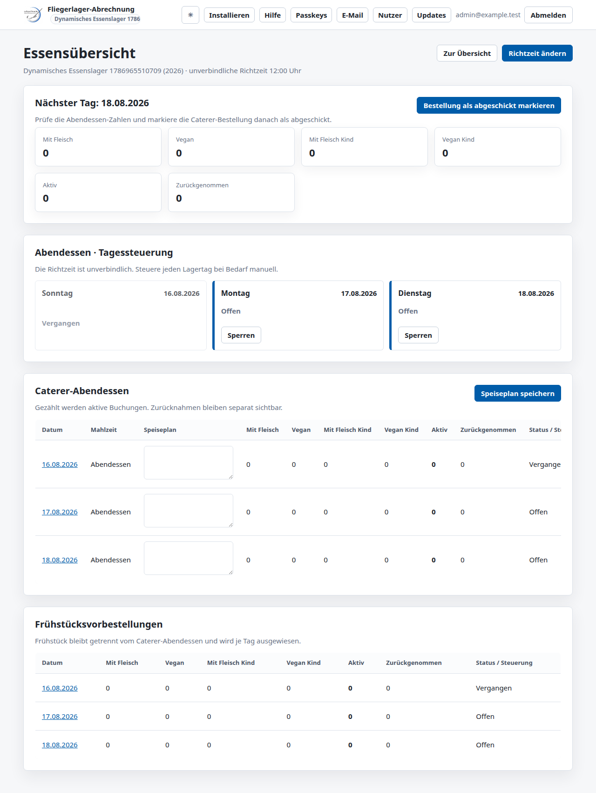
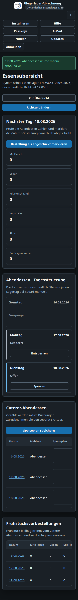

# Manual dinner booking calendar

## Requirement and behavior

The meal overview now exposes a responsive dinner-only day-card calendar (`data-meal-calendar="dinner"`) for every camp day. Past days show **Vergangen**, manually closed days **Gesperrt**, and all other days **Offen**. Today and future days offer CSRF-protected POST controls to lock and unlock dinner booking; breakfast has no lock controls. Existing detail dialogs, tables, counts, and no-JavaScript operation remain available.

The configured `meal_booking_cutoff_time` remains unchanged internally and is presented as an unverbindliche **Richtzeit** for reminders. Dinner booking and retraction remain available on the current day until an administrator manually closes it. Marking a caterer order as sent is documentation only and no longer locks booking. Breakfast remains available today and on future camp days. PWA cache version 35 was bumped to 36 (surfaces 36/37/36) because `app-v8.css` changed.

Desktop light theme:

Mobile dark theme:

## Root cause, tests, and risks

The former state resolver automatically locked next-day meals at the configured cutoff and treated a sent caterer order as immutable. Its overview controls lived in dense detail tables and excluded today. TDD red evidence before implementation was 11 failed / 115 passed. A final review added two more RED regressions: seven per-day override queries instead of one preload, and a participant reminder created after manual closure. Both are GREEN now.

The resulting contract is covered at service, view, kiosk, notification, PWA, and browser levels, including same-day booking and retraction, dinner-only override validation, past-day rejection, reminder suppression, bounded override queries, and mobile overflow. The full Python suite passes with 1,131 passed and 5 skipped; Mypy reports no issues in 116 source files. Chromium and Firefox validate the new calendar flow in light/dark and desktop/mobile layouts. Local WebKit execution requires a missing host system library and is left to the dependency-complete CI environment.

A review follow-up closes the transaction race between the initial kiosk availability check and a concurrent manual close. Booking now rechecks every submitted meal day after acquiring the shared camp row lock, while retraction rechecks the locked signup before changing its charge or status. Deterministic lock-boundary tests first reproduced both stale writes, and PostgreSQL concurrency tests now prove that a committed administrative close wins against a waiting booking or retraction without partial multi-day writes.

The dynamic browser test also derives form values and visible labels from one explicit `Europe/Berlin` calendar date. Its fixed UTC-boundary regression first reproduced the former `2026-08-17` result at an instant Django treats as `2026-08-18`, then passed in Chromium, Firefox, and WebKit with the timezone-aware helper.
